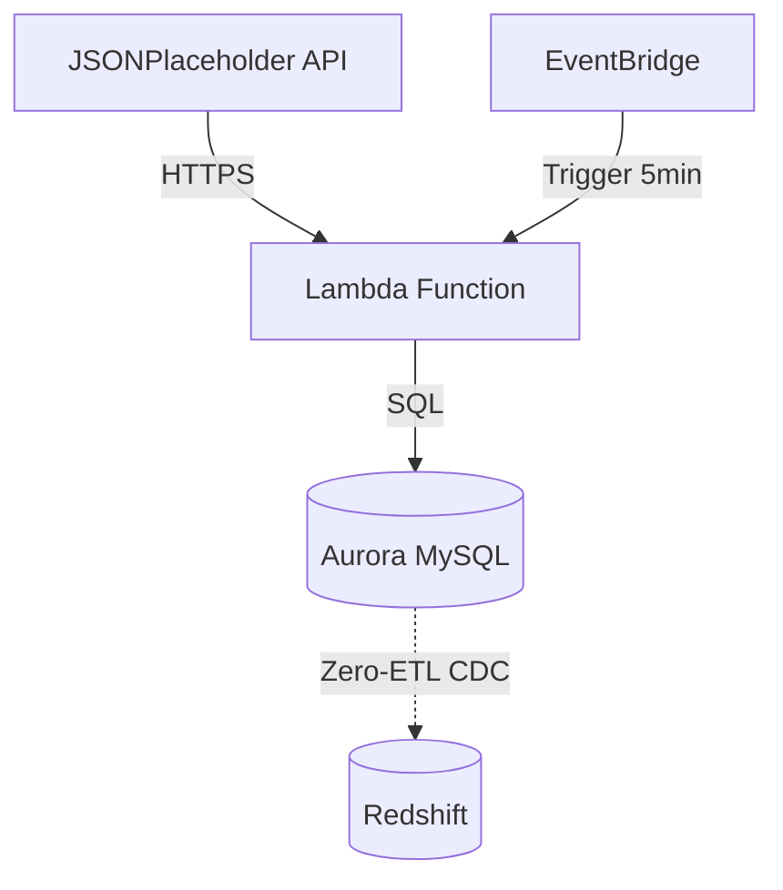
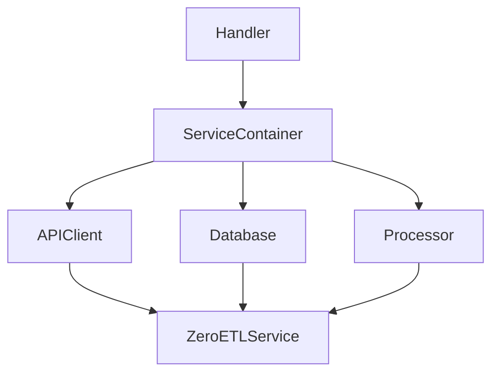
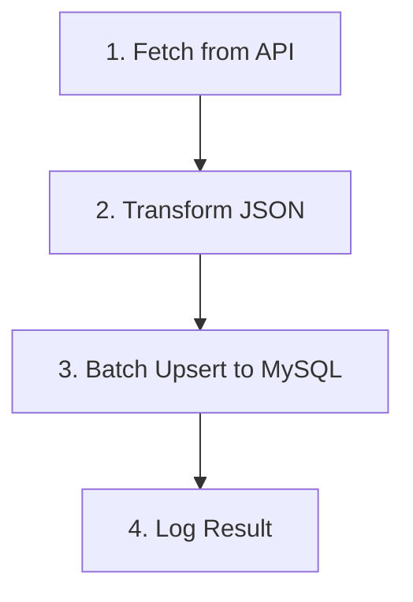
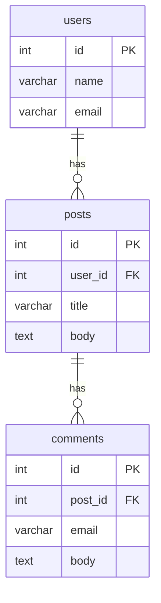
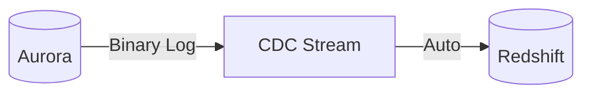
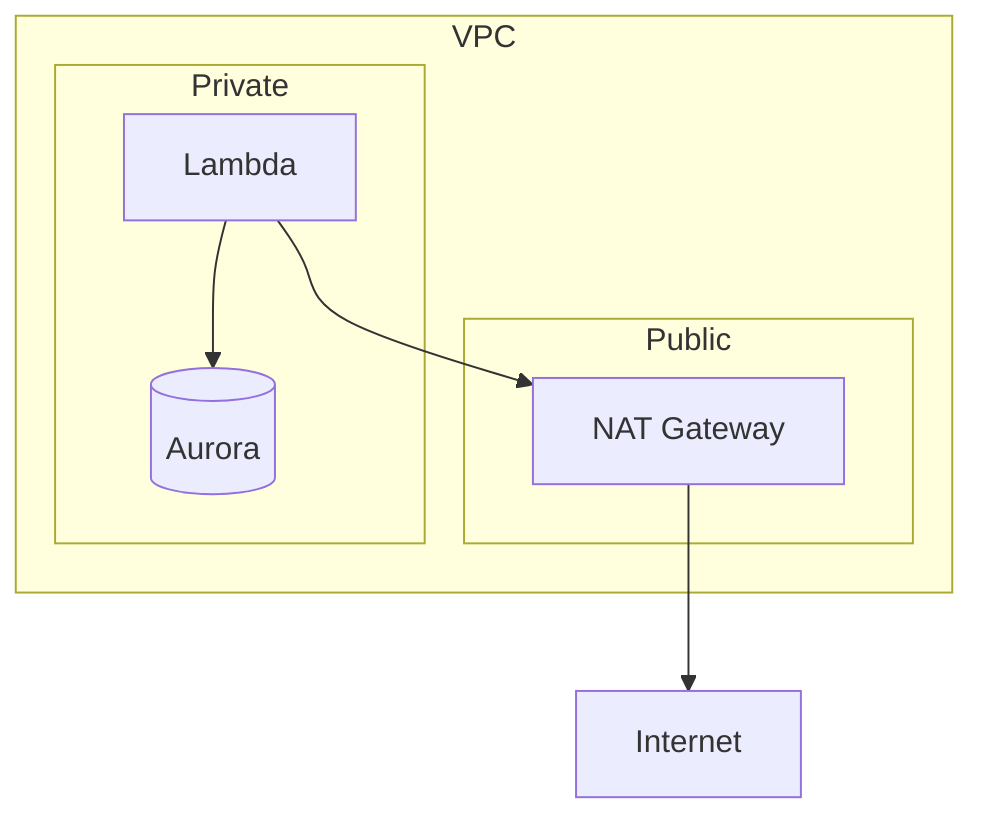
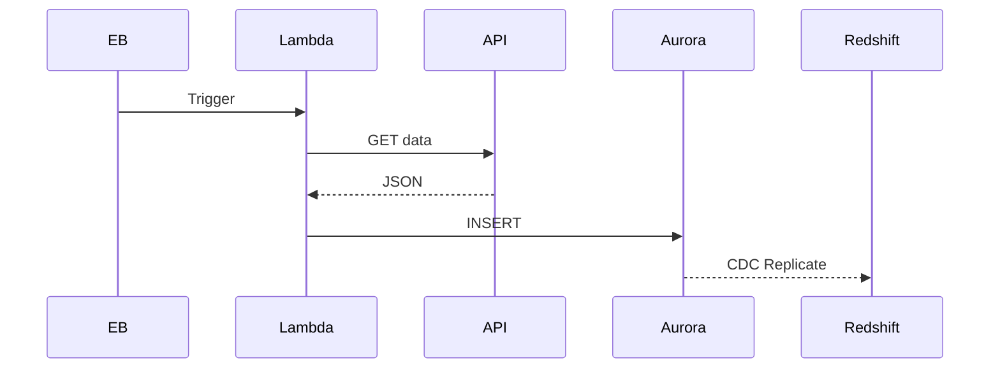

# AWS Zero-ETL Architecture Documentation

## Overview

This document describes the architecture of the AWS Zero-ETL demo that replicates data from Aurora MySQL to Amazon Redshift in near real-time.

## Architecture Diagram



## Components

### 1. Data Source: JSONPlaceholder API

| Endpoint | Description | Record Count |
|----------|-------------|--------------|
| `/users` | User profiles | 10 |
| `/posts` | Blog posts | 100 |
| `/comments` | Comments | 500 |

---

### 2. Ingestion Layer: AWS Lambda

**Runtime:** Python 3.12  
**Schedule:** Every 5 minutes

#### Code Architecture (DI)



#### Ingestion Flow



---

### 3. Database: Aurora MySQL

**Engine:** Aurora MySQL 8.0 (3.04+)  
**Storage:** Encrypted

#### Zero-ETL Configuration

| Parameter | Value |
|-----------|-------|
| `binlog_format` | `ROW` |
| `aurora_enhanced_binlog` | `1` |
| `binlog_row_image` | `FULL` |

#### Schema



---

### 4. Zero-ETL Integration

**Type:** Aurora MySQL → Redshift  
**Latency:** Seconds to minutes

#### How It Works



| Phase | Duration |
|-------|----------|
| Integration Creation | 1-2 min |
| Initial Seed | 20-30 min |
| CDC Active | Ongoing |

---

### 5. Analytics: Redshift

```sql
-- Posts per user
SELECT u.name, COUNT(p.id) as posts
FROM users u
LEFT JOIN posts p ON u.id = p.user_id
GROUP BY u.id, u.name;
```

---

### 6. Monitoring

| Metric | Namespace |
|--------|-----------|
| Duration | AWS/Lambda |
| Errors | AWS/Lambda |
| ReplicationLag | AWS/RDS |

---

## Security



| Layer | Protection |
|-------|------------|
| Database | Encryption at rest |
| Network | TLS in transit |
| IAM | Least privilege |

---

## Cost Estimation

| Service | Est. Cost/Month |
|---------|-----------------|
| Aurora MySQL | ~$200 |
| Lambda | ~$5 |
| NAT Gateway | ~$35 |
| Redshift | ~$50 |
| **Total** | **~$290** |

---

## Data Flow



---

## References

- [Aurora Zero-ETL](https://docs.aws.amazon.com/AmazonRDS/latest/AuroraUserGuide/zero-etl.html)
- [Redshift Serverless](https://docs.aws.amazon.com/redshift/latest/mgmt/serverless-whatis.html)
