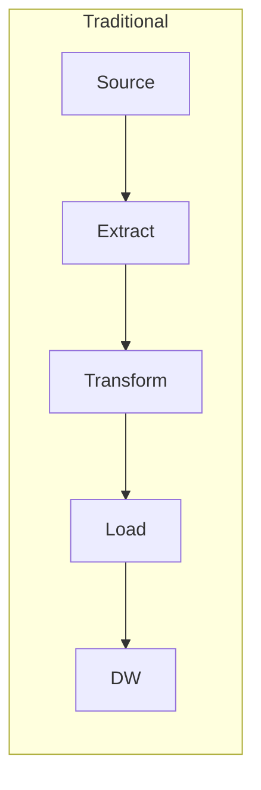
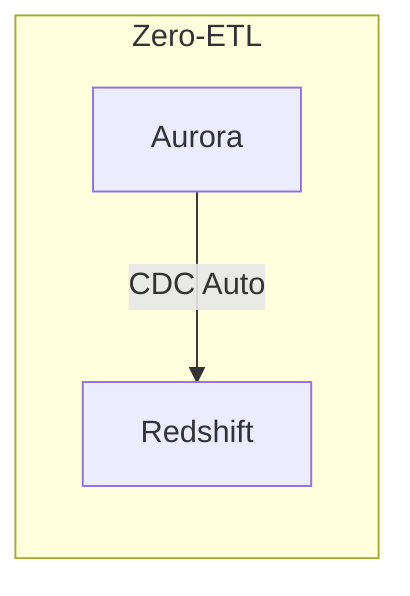
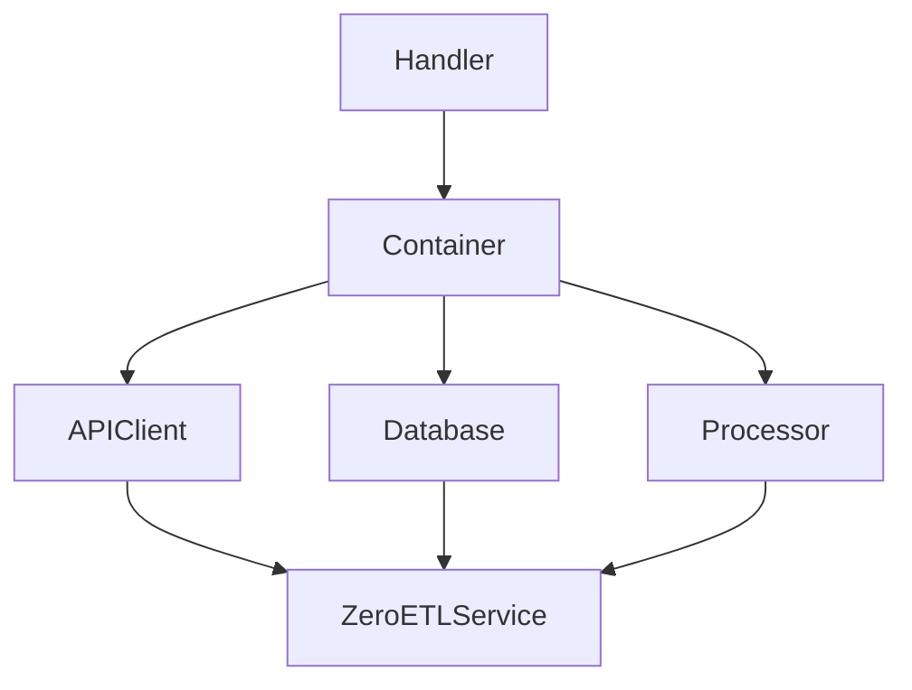
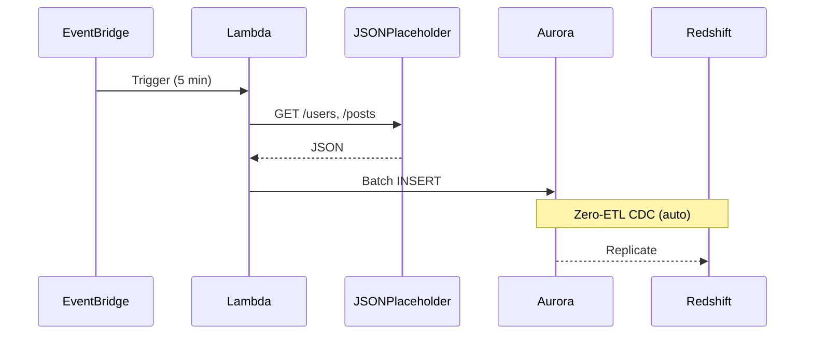

# Building a Near Real-Time Analytics Pipeline with AWS Zero-ETL: A Practical Guide

> TL;DR: This guide shows how to replicate transactional data from Amazon Aurora (MySQL) to Amazon Redshift using AWS Zero-ETL, including Aurora binlog configuration, a sample SAM template, and deployment notes.

---

## Introduction

AWS Zero-ETL enables near real-time replication from Aurora to Redshift without custom ETL code. This guide covers the required Aurora settings, a Lambda ingestion example, deployment with AWS SAM, and the steps to configure the Zero-ETL integration for analytics in Redshift.

## What is Zero-ETL?

Zero-ETL is AWS's managed integration that reduces the need for custom extract-transform-load pipelines by streaming change data from Aurora into Redshift.





Key benefits:

- No pipeline code to maintain
- Near real-time replication (seconds to minutes latency)
- Transactional consistency
- Automatic schema mapping between source and target

---

## Prerequisites

Ensure you have the following before proceeding:

- AWS CLI v2 configured with appropriate permissions
- AWS SAM CLI installed (`pip install aws-sam-cli`)
- Python 3.12+
- Docker (for SAM local testing)
- An AWS account with permissions for RDS, Redshift, Lambda, VPC

## Step 1: Project Structure

```
zero-etl-demo/
├── template.yaml
├── samconfig.toml
├── src/lambda/
│   ├── handler.py
│   ├── container.py
│   ├── service.py
│   └── requirements.txt
├── db/schema.sql
└── scripts/setup_zero_etl.sh
```

## Step 2: SAM Template (Infrastructure as Code)

### Aurora MySQL Configuration

```yaml
DBClusterParameterGroup:
  Type: AWS::RDS::DBClusterParameterGroup
  Properties:
    Family: aurora-mysql8.0
    Parameters:
      binlog_format: ROW
      aurora_enhanced_binlog: "1"
      binlog_row_image: FULL

AuroraDBCluster:
  Type: AWS::RDS::DBCluster
  Properties:
    Engine: aurora-mysql
    EngineVersion: 8.0.mysql_aurora.3.04.0
    StorageEncrypted: true
    DBClusterParameterGroupName: !Ref DBClusterParameterGroup
```

Note: After CloudFormation creates the cluster with the parameter group, reboot the writer instance via Console or CLI for binlog parameters to apply.

**Zero-ETL requirements:**

- Engine version must be Aurora MySQL 3.04.0+
- Storage encryption must be enabled
- Binary logging must be ROW format
- Writer instance must be rebooted after parameter group changes

### Lambda Function

```yaml
IngestFunction:
  Type: AWS::Serverless::Function
  Properties:
    Runtime: python3.12
    Handler: handler.lambda_handler
    VpcConfig:
      SecurityGroupIds:
        - !Ref LambdaSecurityGroup
      SubnetIds:
        - !Ref PrivateSubnet1
        - !Ref PrivateSubnet2
    Events:
      ScheduledIngestion:
        Type: Schedule
        Properties:
          Schedule: rate(5 minutes)
```

## Step 3: Lambda Code with Dependency Injection



### DI Container

```python
class ServiceContainer:
    def __init__(self):
        self._factories = {}
        self._instances = {}
  
    def register(self, name: str, factory: Callable):
        self._factories[name] = factory
  
    def resolve(self, name: str):
        if name not in self._instances:
            self._instances[name] = self._factories[name](self)
        return self._instances[name]
```

### Lambda Handler

```python
def lambda_handler(event, context):
    container = None
    try:
        container = create_container()
        service = container.resolve("zero_etl_service")
        summary = service.run_full_ingestion()
      
        return {
            "statusCode": 200 if summary.success else 207,
            "body": json.dumps({
                "run_id": summary.run_id,
                "total_records": summary.total_records,
            })
        }
    finally:
        if container:
            container.dispose()
```

## Step 4: Database Schema

Note: Foreign keys with `CASCADE` are not supported by Zero-ETL.

```sql
-- This will fail with Zero-ETL
FOREIGN KEY (user_id) REFERENCES users(id) ON DELETE CASCADE

-- Use RESTRICT instead
FOREIGN KEY (user_id) REFERENCES users(id) ON DELETE RESTRICT
```

```sql
CREATE TABLE users (
    id INT PRIMARY KEY,
    name VARCHAR(255) NOT NULL,
    email VARCHAR(255) UNIQUE NOT NULL
) ENGINE=InnoDB;

CREATE TABLE posts (
    id INT PRIMARY KEY,
    user_id INT NOT NULL,
    title VARCHAR(500) NOT NULL,
    FOREIGN KEY (user_id) REFERENCES users(id) ON DELETE RESTRICT
) ENGINE=InnoDB;
```

## Step 5: Deploy the Stack

```bash
sam build
sam deploy --guided
```

After deployment, obtain the Aurora endpoint, reboot the writer instance to apply binlog settings, and run the schema script.

```bash
# Get Aurora endpoint
ENDPOINT=$(aws cloudformation describe-stacks \
    --stack-name zero-etl-demo \
    --query 'Stacks[0].Outputs[?OutputKey==`AuroraClusterEndpoint`].OutputValue' \
    --output text)

# Reboot writer instance
aws rds reboot-db-instance --db-instance-identifier zero-etl-demo-instance-1

# Wait for instance to be available, then run schema
mysql -h $ENDPOINT -u admin -p < db/schema.sql
```

## Step 6: Set Up Zero-ETL Integration

```bash
aws rds create-integration \
    --integration-name zero-etl-demo \
    --source-arn arn:aws:rds:us-east-1:123456789:cluster:my-cluster \
    --target-arn arn:aws:redshift-serverless:us-east-1:123456789:namespace/my-ns
```

Note: Initial synchronization may take 20–30 minutes.

## Step 7: Query Analytics in Redshift

```sql
CREATE DATABASE zero_etl_db FROM INTEGRATION 'arn:aws:rds:...';

-- Posts per user
SELECT u.name, COUNT(p.id) as post_count
FROM zero_etl_db.public.users u
LEFT JOIN zero_etl_db.public.posts p ON u.id = p.user_id
GROUP BY u.id, u.name
ORDER BY post_count DESC;
```

## Data Flow Summary



## Monitoring

Metrics to monitor include:

- Lambda: Duration, Errors
- RDS: ZeroETLIntegrationLatency (or equivalent)

## Cost Considerations

| Service         | Est. Monthly Cost |
|-----------------|-------------------|
| Aurora MySQL    | ~$200             |
| Lambda          | ~$5               |
| NAT Gateway     | ~$35              |
| Redshift        | ~$50              |
| **Total**       | **~$290**         |

## Limitations

1. Foreign keys with CASCADE are not supported — use RESTRICT instead.
2. Reboot is required after parameter group changes for binlog settings to apply.
3. Initial synchronization can take 20–30 minutes.
4. Aurora engine version requirements apply (3.04.0+).

## Conclusion

AWS Zero-ETL provides a managed replication path between Aurora and Redshift that reduces operational overhead and supports near-real-time analytics. It is suitable for cases where replication without custom ETL logic is desired.

---

## Resources

- [AWS Zero-ETL Documentation](https://docs.aws.amazon.com/AmazonRDS/latest/AuroraUserGuide/zero-etl.html)
- [Aurora MySQL Supported Versions](https://docs.aws.amazon.com/AmazonRDS/latest/AuroraUserGuide/Concepts.Aurora_Fea_Regions_DB-eng.Feature.Zero-ETL.html)
- [Redshift Serverless](https://docs.aws.amazon.com/redshift/latest/mgmt/serverless-whatis.html)

---

Questions or feedback are welcome. Connect via LinkedIn for further discussion.
