# Xây dựng một Pipeline Phân tích Gần Thời Gian Thực với AWS Zero-ETL: Hướng dẫn Thực hành

> TL;DR: Hướng dẫn này trình bày cách xây dựng một pipeline serverless để nhân bản dữ liệu giao dịch từ Amazon Aurora (MySQL) sang Amazon Redshift bằng tích hợp AWS Zero-ETL.

---

## Giới thiệu

Các pipeline ETL (Extract, Transform, Load) truyền thống vẫn được sử dụng rộng rãi trong phân tích dữ liệu nhưng thường gây ra chi phí vận hành, độ trễ và khối lượng bảo trì. AWS Zero-ETL là một phương án thay thế giúp giảm gánh nặng vận hành bằng cách sao chép dữ liệu từ Aurora sang Redshift với cấu hình tối thiểu.

AWS Zero-ETL là một dịch vụ quản lý giúp sao chép liên tục dữ liệu từ Amazon Aurora đến Amazon Redshift ở gần thời gian thực, không yêu cầu viết mã ETL tùy chỉnh.

Bài hướng dẫn này minh họa cách xây dựng một demo bao gồm:

- Thu thập dữ liệu từ API công cộng bằng AWS Lambda
- Lưu trữ trong Aurora MySQL
- Nhân bản sang Redshift qua Zero-ETL
- Hỗ trợ phân tích gần thời gian thực

## Zero-ETL là gì?

Zero-ETL là cách tiếp cận của AWS nhằm giảm thiểu nhu cầu viết các pipeline ETL tùy chỉnh.

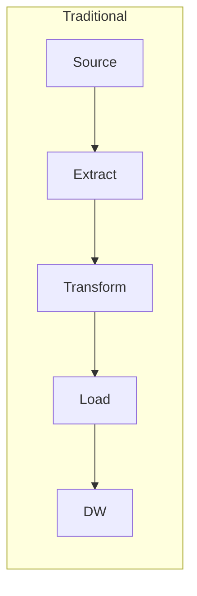

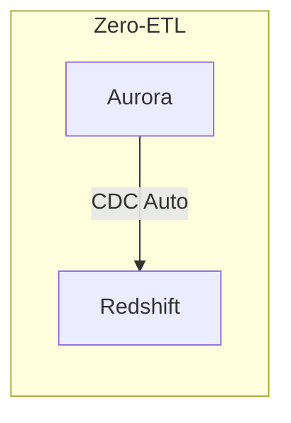

Lợi ích chính:

- Không cần duy trì mã pipeline
- Nhân bản gần thời gian thực (độ trễ: vài giây đến vài phút)
- Duy trì tính nhất quán giao dịch
- Ánh xạ sơ đồ (schema) tự động giữa nguồn và đích

---

## Nội dung chuyên sâu: Các khái niệm liên quan đến Zero-ETL

Phần này tóm tắt các khái niệm kỹ thuật cần biết khi cấu hình và vận hành tích hợp Zero-ETL.

### Sự tiến hoá của tích hợp dữ liệu: ETL → ELT → Zero-ETL

#### ETL truyền thống (Extract-Transform-Load)

ETL xuất hiện từ thập niên 1970 cùng với kho dữ liệu (data warehousing). Quy trình theo tuần tự:

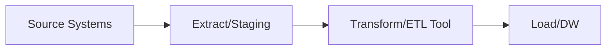

Đặc điểm:

- Transform xảy ra trước khi tải vào đích
- Cần máy chủ ETL chuyên dụng để xử lý
- Theo lô (batch) (hàng giờ, hàng ngày, v.v.)
- Độ trễ cao hơn (giờ đến ngày)

Các công cụ phổ biến: Informatica, Talend, SSIS, DataStage

#### ELT hiện đại (Extract-Load-Transform)

Với kho dữ liệu đám mây (Redshift, BigQuery, Snowflake), mô hình chuyển sang ELT:

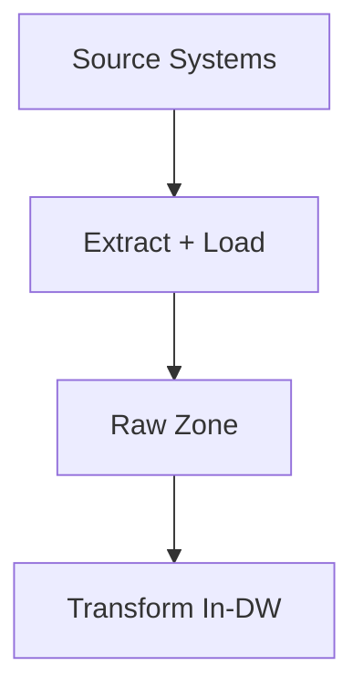

Đặc điểm:

- Transform thực hiện bên trong kho dữ liệu
- Tận dụng sức mạnh tính toán của DW (MPP)
- Vẫn yêu cầu mã pipeline
- Có thể gần thời gian thực khi dùng streaming

Công cụ: Fivetran, Airbyte, Stitch, dbt

#### Zero-ETL

Zero-ETL giảm nhu cầu về pipeline tường minh bằng cách cung cấp nhân bản liên tục từ DB nguồn tới DW:

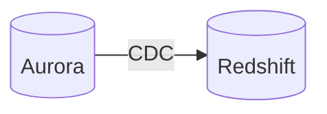

Đặc điểm:

- Không cần mã pipeline tùy chỉnh
- Nhân bản liên tục (độ trễ thấp)
- Ánh xạ sơ đồ do dịch vụ xử lý
- AWS quản lý hạ tầng liên quan

### Change Data Capture (CDC)

CDC là cơ chế nền tảng cho Zero-ETL. CDC ghi lại và truyền các thay đổi ở mức dòng (row-level) từ DB nguồn đến đích.

#### Cách CDC hoạt động

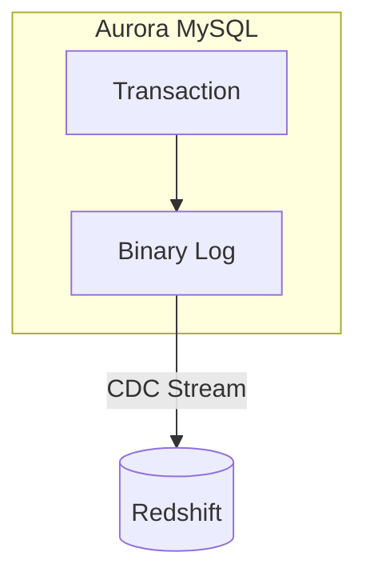

#### So sánh các phương pháp CDC

| Phương pháp         | Mô tả                           | Độ trễ | Ảnh hưởng tới nguồn |
| ------------------- | ------------------------------- | ------ | -------------------- |
| Log-based           | Đọc nhật ký giao dịch (binlog)   | Thấp   | Tối thiểu            |
| Trigger-based       | Dùng trigger trên bảng          | Thấp   | Cao (ảnh hưởng hiệu năng) |
| Timestamp-based     | Truy vấn cột `updated_at`       | Trung bình | Trung bình (tải truy vấn) |
| Snapshot-based      | So sánh toàn bộ bảng            | Cao    | Cao (khóa bảng)      |

Zero-ETL sử dụng log-based CDC (MySQL binlog) để đạt độ trễ thấp và giảm tác động lên nguồn.

#### Cấu hình Binary Log

Các thiết lập cần thiết cho CDC đáng tin cậy:

```sql
-- Required settings
binlog_format = ROW           -- Row-level changes (not statement)
binlog_row_image = FULL       -- Complete row data (before + after)
aurora_enhanced_binlog = 1    -- Optimized for Aurora CDC
```

Lưu ý: Sau khi áp dụng DB cluster parameter group, cần khởi động lại (reboot) instance writer của Aurora để các thiết lập binlog có hiệu lực. Nếu bỏ qua bước này, tích hợp có thể không hoạt động và không báo lỗi rõ ràng.

```bash
# Reboot writer instance after parameter group changes
aws rds reboot-db-instance --db-instance-identifier your-writer-instance
```

**Row format so với statement format:** ghi binlog ở mức dòng giúp tái tạo chính xác các thay đổi và là yêu cầu để CDC hoạt động đáng tin cậy.

### OLTP vs OLAP

| Khía cạnh      | OLTP (Aurora)            | OLAP (Redshift)             |
|---------------|--------------------------|------------------------------|
| Mục đích      | Giao dịch hàng ngày      | Phân tích phức tạp          |
| Truy vấn       | INSERT, SELECT theo ID   | Tổng hợp, JOINs             |
| Số dòng        | 1-100 mỗi truy vấn       | Hàng triệu dòng mỗi truy vấn |
| Độ trễ         | Millisecond              | Giây                        |
| Lưu trữ        | Hướng hàng (row-oriented)| Hướng cột (column-oriented) |

Zero-ETL cung cấp đường dẫn nhân bản thẳng giữa hệ OLTP và OLAP.

### Khái niệm kiến trúc

#### Modern Data Stack

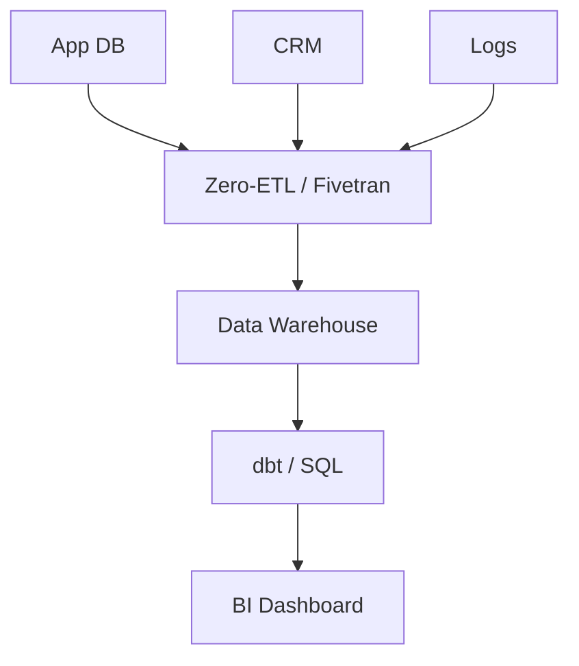

#### Medallion Architecture (Bronze/Silver/Gold)

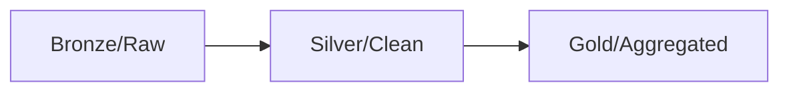

Với Zero-ETL, lớp Bronze có thể được điền tự động; các lớp Silver/Gold thực hiện bằng các phép biến đổi trong kho dữ liệu.

### Tính nhất quán cuối cùng và độ trễ nhân bản

Zero-ETL cung cấp tính nhất quán cuối cùng (eventual consistency) với độ trễ nhân bản ngắn.

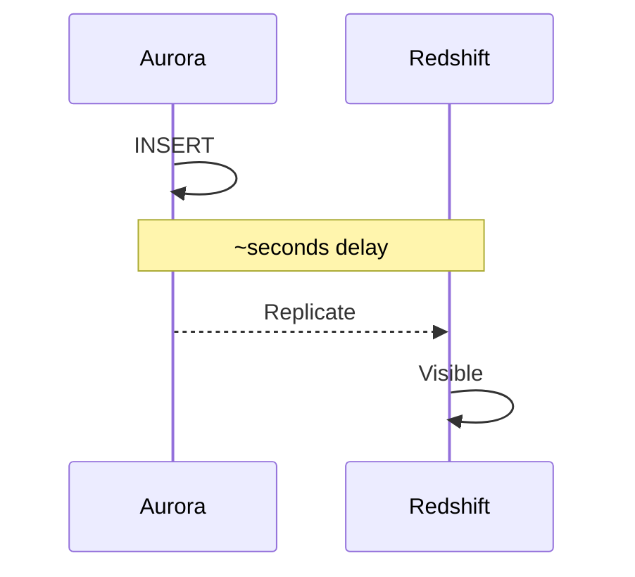

Hệ quả:

- Các truy vấn phân tích có thể thấy dữ liệu hơi cũ (stale)
- Hành vi này phù hợp cho nhiều trường hợp BI
- Theo dõi độ trễ nhân bản nếu cần dashboard gần thời gian thực

### So sánh: Zero-ETL và các giải pháp khác

| Tính năng          | Zero-ETL    | Fivetran/Airbyte | Debezium     |
| ------------------ | ----------- | ---------------- | ------------ |
| Nỗ lực thiết lập    | Thấp        | Trung bình       | Cao          |
| Bảo trì            | Thấp        | Thấp             | Cao          |
| Độ trễ             | Giây        | Phút             | Giây         |
| Chi phí            | Đã gồm*     | Tính theo hàng   | Chi phí hạ tầng |
| Hỗ trợ nguồn       | Chỉ Aurora  | 200+ nguồn       | Nhiều DB     |

*Chi phí Zero-ETL được tính trong giá Aurora/Redshift.

### Khi nào dùng Zero-ETL

Trường hợp phù hợp:

- Aurora MySQL/PostgreSQL làm nguồn
- Redshift làm đích
- Nhu cầu nhân bản đơn giản
- Muốn giảm gánh nặng vận hành

Cân nhắc giải pháp khác khi:

- Cần biến đổi phức tạp trước khi tải
- Nhiều DB nguồn khác loại (heterogeneous)
- Đích không phải Redshift

## Tổng quan kiến trúc

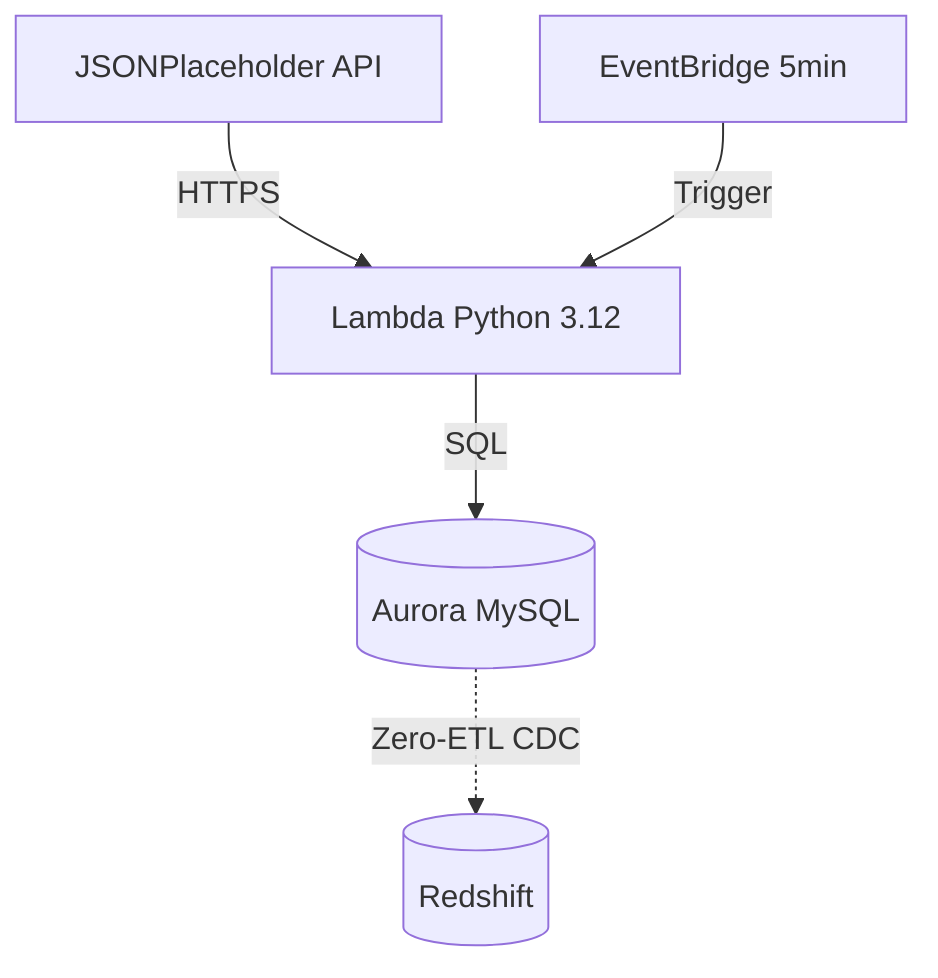

## Yêu cầu trước khi bắt đầu

Đảm bảo bạn có:

- AWS CLI v2 cấu hình với quyền phù hợp
- AWS SAM CLI (`pip install aws-sam-cli`)
- Python 3.12+
- Docker (cho thử nghiệm SAM local)
- Tài khoản AWS có quyền cho RDS, Redshift, Lambda, VPC

## Bước 1: Cấu trúc dự án

```
zero-etl-demo/
├── template.yaml
├── samconfig.toml
├── src/lambda/
│   ├── handler.py
│   ├── container.py
│   ├── service.py
│   └── requirements.txt
├── db/schema.sql
└── scripts/setup_zero_etl.sh
```

## Bước 2: Template SAM (IaC)

### Cấu hình Aurora MySQL

```yaml
DBClusterParameterGroup:
  Type: AWS::RDS::DBClusterParameterGroup
  Properties:
    Family: aurora-mysql8.0
    Parameters:
      binlog_format: ROW
      aurora_enhanced_binlog: "1"
      binlog_row_image: FULL

AuroraDBCluster:
  Type: AWS::RDS::DBCluster
  Properties:
    Engine: aurora-mysql
    EngineVersion: 8.0.mysql_aurora.3.04.0
    StorageEncrypted: true
    DBClusterParameterGroupName: !Ref DBClusterParameterGroup
```

Lưu ý: Sau khi CloudFormation tạo cluster với parameter group, cần khởi động lại instance writer thông qua Console hoặc CLI để các thiết lập binlog có hiệu lực.

**Yêu cầu Zero-ETL:**

- Phiên bản engine phải là Aurora MySQL 3.04.0+
- Mã hóa lưu trữ phải được bật
- Binary logging ở định dạng ROW
- Sau khi thay đổi parameter group, phải khởi động lại instance writer

### Hàm Lambda

```yaml
IngestFunction:
  Type: AWS::Serverless::Function
  Properties:
    Runtime: python3.12
    Handler: handler.lambda_handler
    VpcConfig:
      SecurityGroupIds:
        - !Ref LambdaSecurityGroup
      SubnetIds:
        - !Ref PrivateSubnet1
        - !Ref PrivateSubnet2
    Events:
      ScheduledIngestion:
        Type: Schedule
        Properties:
          Schedule: rate(5 minutes)
```

## Bước 3: Mã Lambda với Dependency Injection

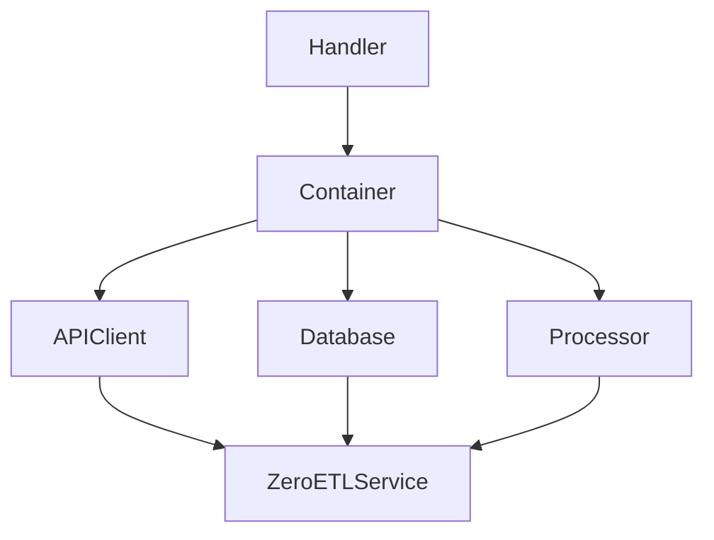

### DI Container

```python
class ServiceContainer:
    def __init__(self):
        self._factories = {}
        self._instances = {}
  
    def register(self, name: str, factory: Callable):
        self._factories[name] = factory
  
    def resolve(self, name: str):
        if name not in self._instances:
            self._instances[name] = self._factories[name](self)
        return self._instances[name]
```

### Lambda Handler

```python
def lambda_handler(event, context):
    container = None
    try:
        container = create_container()
        service = container.resolve("zero_etl_service")
        summary = service.run_full_ingestion()
      
        return {
            "statusCode": 200 if summary.success else 207,
            "body": json.dumps({
                "run_id": summary.run_id,
                "total_records": summary.total_records,
            })
        }
    finally:
        if container:
            container.dispose()
```

## Bước 4: Schema cơ sở dữ liệu

Lưu ý: Foreign key với `CASCADE` không được Zero-ETL hỗ trợ.

```sql
-- Sẽ thất bại với Zero-ETL
FOREIGN KEY (user_id) REFERENCES users(id) ON DELETE CASCADE

-- Sử dụng RESTRICT thay thế
FOREIGN KEY (user_id) REFERENCES users(id) ON DELETE RESTRICT
```

```sql
CREATE TABLE users (
    id INT PRIMARY KEY,
    name VARCHAR(255) NOT NULL,
    email VARCHAR(255) UNIQUE NOT NULL
) ENGINE=InnoDB;

CREATE TABLE posts (
    id INT PRIMARY KEY,
    user_id INT NOT NULL,
    title VARCHAR(500) NOT NULL,
    FOREIGN KEY (user_id) REFERENCES users(id) ON DELETE RESTRICT
) ENGINE=InnoDB;
```

## Bước 5: Triển khai stack

```bash
sam build
sam deploy --guided
```

Sau khi triển khai, lấy endpoint Aurora, khởi động lại instance writer để áp dụng thiết lập binlog, và chạy script tạo schema.

```bash
# Get Aurora endpoint
ENDPOINT=$(aws cloudformation describe-stacks \
    --stack-name zero-etl-demo \
    --query 'Stacks[0].Outputs[?OutputKey==`AuroraClusterEndpoint`].OutputValue' \
    --output text)

# Reboot writer instance
aws rds reboot-db-instance --db-instance-identifier zero-etl-demo-instance-1

# Wait for instance to be available, then run schema
mysql -h $ENDPOINT -u admin -p < db/schema.sql
```

## Bước 6: Thiết lập tích hợp Zero-ETL

```bash
aws rds create-integration \
    --integration-name zero-etl-demo \
    --source-arn arn:aws:rds:us-east-1:123456789:cluster:my-cluster \
    --target-arn arn:aws:redshift-serverless:us-east-1:123456789:namespace/my-ns
```

Lưu ý: Đồng bộ ban đầu có thể mất 20–30 phút.

## Bước 7: Truy vấn phân tích trên Redshift

```sql
CREATE DATABASE zero_etl_db FROM INTEGRATION 'arn:aws:rds:...';

-- Posts per user
SELECT u.name, COUNT(p.id) as post_count
FROM zero_etl_db.public.users u
LEFT JOIN zero_etl_db.public.posts p ON u.id = p.user_id
GROUP BY u.id, u.name
ORDER BY post_count DESC;
```

## Luồng dữ liệu (Data Flow)

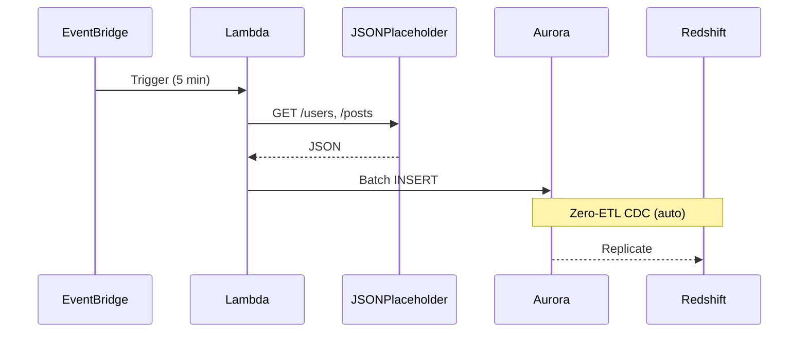

## Giám sát

Các chỉ số nên theo dõi:

- Lambda: Duration, Errors
- RDS: ZeroETLIntegrationLatency (hoặc tương đương)

## Chi phí ước tính

| Service         | Est. Monthly Cost |
|-----------------|-------------------|
| Aurora MySQL    | ~$200             |
| Lambda          | ~$5               |
| NAT Gateway     | ~$35              |
| Redshift        | ~$50              |
| **Total**       | **~$290**         |

## Hạn chế

1. Foreign key với CASCADE không được hỗ trợ — sử dụng RESTRICT.
2. Cần khởi động lại instance sau khi thay đổi parameter group để các thiết lập binlog có hiệu lực.
3. Đồng bộ ban đầu có thể mất 20–30 phút.
4. Yêu cầu phiên bản Aurora (3.04.0+) áp dụng.

## Kết luận

AWS Zero-ETL cung cấp đường dẫn nhân bản được quản lý giữa Aurora và Redshift, giúp giảm gánh nặng vận hành và hỗ trợ phân tích gần thời gian thực. Giải pháp phù hợp khi cần nhân bản dữ liệu mà không muốn phát triển mã ETL tùy chỉnh.

---

## Tài liệu tham khảo

- [AWS Zero-ETL Documentation](https://docs.aws.amazon.com/AmazonRDS/latest/AuroraUserGuide/zero-etl.html)
- [Aurora MySQL Supported Versions](https://docs.aws.amazon.com/AmazonRDS/latest/AuroraUserGuide/Concepts.Aurora_Fea_Regions_DB-eng.Feature.Zero-ETL.html)
- [Redshift Serverless](https://docs.aws.amazon.com/redshift/latest/mgmt/serverless-whatis.html)

---

Mọi câu hỏi hoặc phản hồi xin gửi. Kết nối qua LinkedIn để thảo luận thêm.
